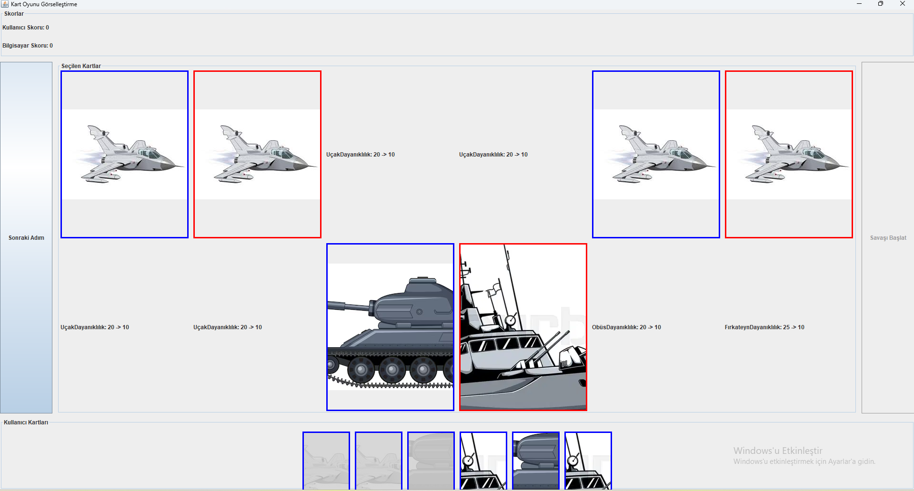

**1-Strateji Oyunu ve Savaş Mekanikleri**

Bu projede, C programlama dili kullanılarak İnsan İmparatorluğu ve Ork Lejyonu olmak üzere iki farklı ırkın karşı karşıya geldiği bir strateji oyunu simülasyonu geliştirdim. Oyunun temel amacı, belirli birimler, kahramanlar ve canavarların yer aldığı iki ordunun savaşını simüle ederek saldırı ve savunma mekaniklerini test etmektir.

**2-Kart oyunu ve Savaş Mekanikleri**

Bu projede, Java programlama dili kullanılarak bir kart oyunu tasarladım. Oyun, bir oyuncu ve bir bilgisayar arasında geçen strateji tabanlı bir savaş simülasyonunu içermektedir. Oyuncular belirli sayıda karta sahiptir ve her kartın saldırı gücü, savunma puanı ve özel yetenekleri gibi belirleyici özellikleri bulunmaktadır.

[Detaylı Bilgi için rapor](./PROLAB1_2/PROLAB1_2%20rapor.pdf)

**3-Yazar İşbirliği Ağı Analizi ve Görselleştirilmesi**

Bu projede, akademik bir veri seti kullanarak yazarlar arasındaki iş birliği ilişkilerini modelleyen bir grafik yapısı oluşturdum. Projenin amacı, yazarların iş birliği ağlarını analiz etmek için grafik veri yapısını kullanmak ve bu yapı üzerinde çeşitli veri yapıları ile algoritmalar uygulamaktır.

Projeyi Python dili kullanarak geliştirdim ve görselleştirme için Dash framework'ünü tercih ettim. 

